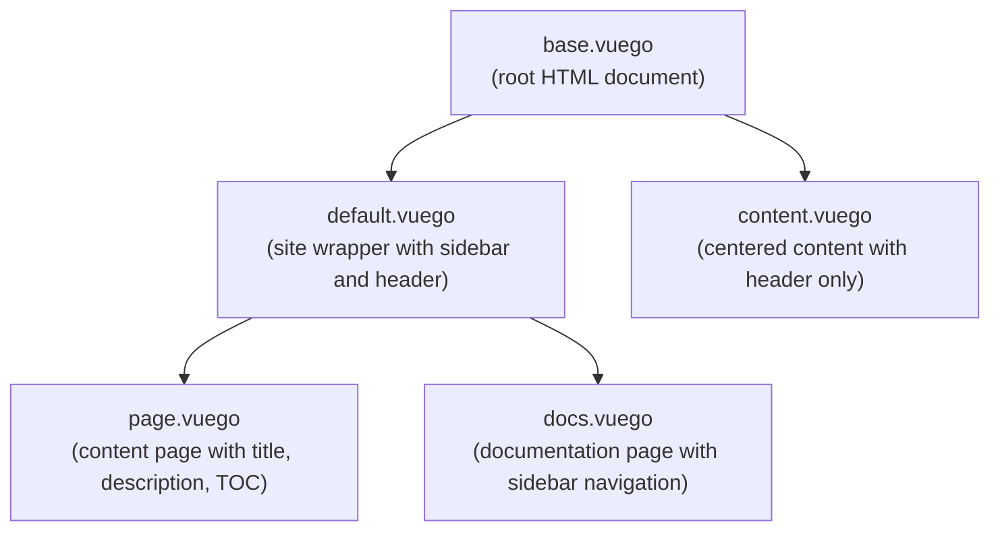

# Vuego + Basecoat

This is a documentation project which is essentially a setup of:

- Basecoat UI: https://basecoatui.com/ (this exact page)
- Tailwind
- Lucide Icons (CDN)
- Template driven JS embeddings (highlightjs, htmx, ...)

It provides a usable setup for documentation-based pages.
To run it, use `vuego-cli docs bootstrap`.

The goals are:

- Create vuego templates
- Document vuego syntax like basecoat documents components
- Create components for reuse
- Create other documentation sites for learning content (multi-language)

The outside dependencies for this are minimal, see:

- grab latest tailwindcss binary from the releases page
- run `atkins generate` in root to refresh css (`two compile steps`)
- no runtime dependency on npm/node
- vuego for templating is go native

The general basecoat setup is there, docs need work. The alert
page is the only current doc. The contents of the folder can
be navigated, take a look around.

## Theme Structure

The Basecoat theme follows the [Vuego Theme Structuring Guide](https://github.com/titpetric/vuego/blob/main/docs/themes.md) conventions.

### Directory Layout

```
basecoat/
├── assets/
│   ├── css/
│   │   ├── styles.css          # Main stylesheet
│   │   └── themes/             # Color variants
│   │       ├── claude.css
│   │       ├── doom-64.css
│   │       └── supabase.css
│   ├── js/                     # Basecoat UI JavaScript
│   └── svg/                    # Vector graphics
├── components/                 # Reusable UI components
│   ├── alert.vuego
│   └── table.vuego
├── data/                       # Global data files
│   ├── menu.yml               # Sidebar navigation
│   ├── pkg.yml                # Package metadata
│   └── theme.yml              # Theme/branding configuration
├── layouts/                    # Page layout templates
│   ├── base.vuego             # Root HTML shell
│   ├── default.vuego          # Site wrapper with sidebar and header
│   ├── content.vuego          # Centered content with header (no sidebar)
│   ├── page.vuego             # Content page with TOC
│   └── docs.vuego             # Documentation page
└── partials/                   # Reusable template fragments
    ├── header.vuego           # Page header with theme toggle
    ├── footer.vuego           # Footer with script loading
    ├── logo.vuego             # Logo/branding (used in header and sidebar)
    ├── sidebar.vuego          # Navigation sidebar
    ├── toc.vuego              # Table of contents
    ├── basecoat.vuego         # Basecoat JS dependencies
    ├── hljs.vuego             # Syntax highlighting
    └── theme.vuego            # Theme initialization
```

### Layout Hierarchy

The theme uses a layout chaining system where templates inherit from parent layouts:



### Overridable Templates

You can override any of the following templates by creating a file with the same path in your project:

| Template | Purpose | Front Matter |
|----------|---------|--------------|
| `layouts/base.vuego` | HTML document shell with `<head>` and scripts | `title`, `description` |
| `layouts/default.vuego` | Site wrapper with sidebar and header | `menu`, `header` |
| `layouts/content.vuego` | Centered content with header (no sidebar) | - |
| `layouts/page.vuego` | Content page layout | `title`, `description`, `toc` |
| `layouts/docs.vuego` | Documentation page with sidebar | `title`, `subtitle`, `sidebar`, `content` |
| `partials/header.vuego` | Page header with theme/dark mode toggles | - |
| `partials/footer.vuego` | Footer scripts (Lucide icons) | - |
| `partials/sidebar.vuego` | Navigation sidebar | `menu`, `header` |
| `partials/toc.vuego` | Table of contents | `toc` (array of `{id, label}`) |

### Using Layouts

Specify a layout in your page's front matter:

```yaml
---
layout: page
title: My Page Title
description: A brief description
toc:
  - id: section-1
    label: Section 1
  - id: section-2
    label: Section 2
---
```

### Available Layouts

#### `base`
The root HTML document. Use this when you need complete control over the page structure.

```yaml
---
layout: base
title: Custom Page
---
```

#### `default`
The standard site wrapper with sidebar navigation and header. Use for documentation sites and apps with navigation.

```yaml
---
layout: default
---
```

#### `content`
Centered content layout with header (theme/dark mode toggle) but no sidebar. Use for standalone pages, apps, or focused content like login forms and dashboards.

```yaml
---
layout: content
---
```

#### `page`
Content page with title, description, and optional table of contents. Extends `default`.

```yaml
---
layout: page
title: Page Title
description: Page description
toc:
  - id: intro
    label: Introduction
---
```

#### `docs`
Documentation page with sidebar navigation. Extends `default`.

```yaml
---
layout: docs
title: Documentation Title
subtitle: Optional subtitle
sidebar:
  - label: Getting Started
    href: /docs/getting-started
    active: true
  - label: Installation
    href: /docs/installation
---
```

### Sidebar Menu Structure

The sidebar expects a `menu` array in your data with groups and items:

```yaml
menu:
  - label: Getting Started
    items:
      - label: Introduction
        url: /introduction
        icon: book-open
      - label: Installation
        url: /installation
        icon: download
  - label: Components
    items:
      - label: Alert
        url: /components/alert
      - label: Table
        url: /components/table
```

### Theme Configuration

Configure your app's branding via `data/theme.yml`:

```yaml
theme:
  header:
    title: My App
    subtitle: Dashboard
```

The theme configuration controls the logo/branding shown in the sidebar header and the main header (when sidebar is disabled).

To customize the logo icon, override the `partials/logo.vuego` partial or use the `icon` slot:

```html
<template include="partials/logo.vuego" v-slot:icon>
  
</template>
```

### GitHub Link

Configure the GitHub repository link in the header via data:

```yaml
github: https://github.com/your/repo
```

If not provided, the GitHub button is hidden from the header.

### Theme Variants

The theme includes multiple color variants in `assets/css/themes/`:

- Default - Standard Basecoat styling
- Claude - Claude-inspired color scheme
- Doom 64 - Dark gaming aesthetic
- Supabase - Supabase-inspired colors

Users can switch themes via the dropdown in the header, with persistence via localStorage.
